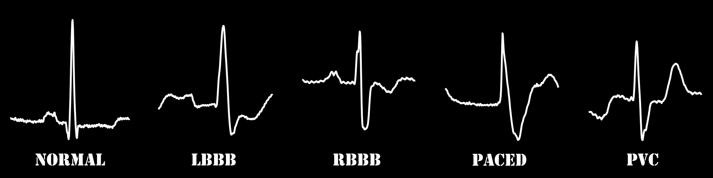
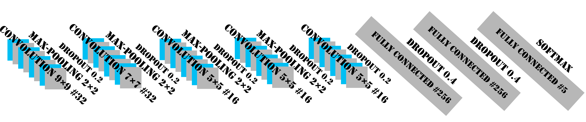
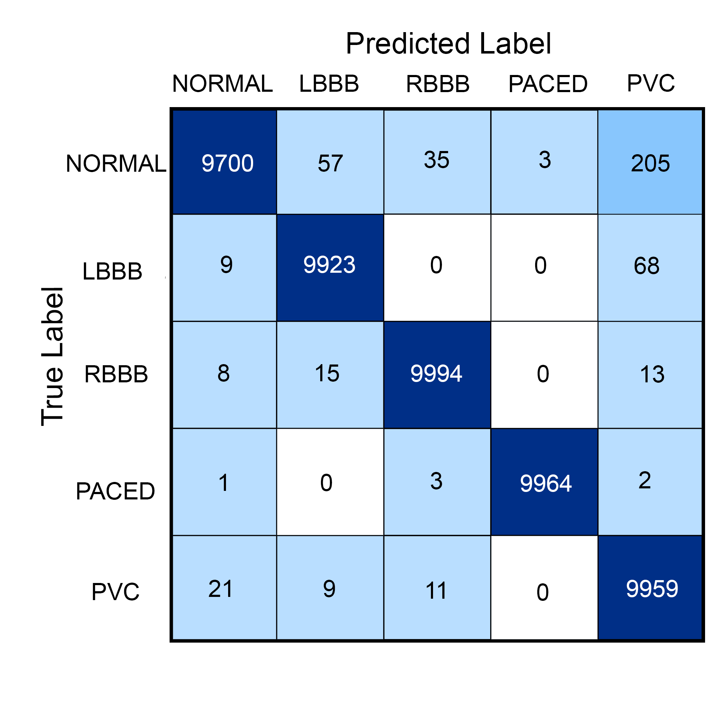

# CMPT-419-726-Project

## classifyAfib.ipynb
This code implements and tests a binary classification CNN model for the image data contained in files image_afib.mat and image_normal2.mat.
**classifyAfib.ipynb should be placed in the same directory as image_afib.mat and image_normal2.mat when run**

## aminCodeConverted.ipynb
A version of Amin's multi-class classification training code designed to work with TensorFlow 2.0's in-built version of Keras.

## Multi-class Classification Dataset
Please dowload the directory from SFU Vault:
https://vault.sfu.ca/index.php/s/5Tei9o8cIXEEl6u

## training.py
This script trains a CNN model to classify the ECG beats images. The trained model and weights are saved in /models.

## testing.py
Running this script will evaluate the trained model on test data.

